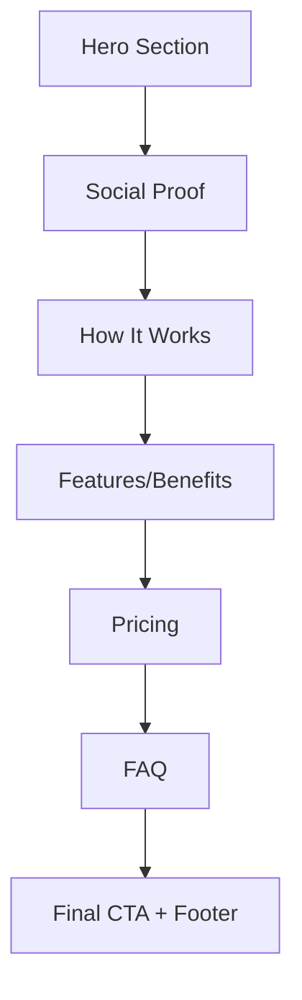
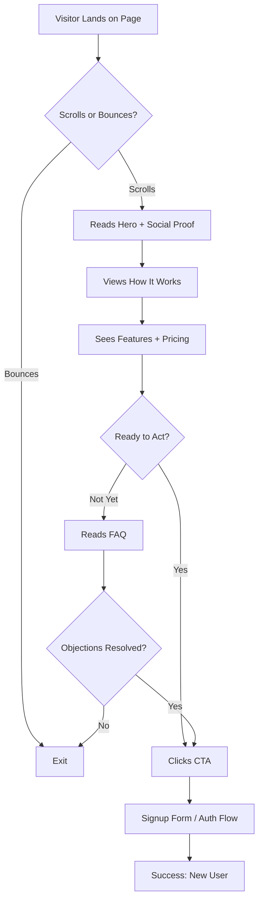

# Floxen UI/UX Specification

This document defines the user experience goals, information architecture, user flows, and visual design specifications for **Floxen's** landing page. It serves as the foundation for visual design and frontend development, ensuring a cohesive and user-centered experience.

**Document Version:** 1.4
**Scope:** One-page landing page
**Last Updated:** January 2025

---

## Table of Contents

1. [UX Goals & Principles](#1-ux-goals--principles)
2. [Information Architecture](#2-information-architecture)
3. [User Flows](#3-user-flows)
4. [Copy & Content](#4-copy--content)
5. [Wireframes & Layouts](#5-wireframes--layouts)
6. [Component Library](#6-component-library)
7. [Branding & Style Guide](#7-branding--style-guide)
8. [Accessibility Requirements](#8-accessibility-requirements)
9. [Responsiveness Strategy](#9-responsiveness-strategy)
10. [Animation & Micro-interactions](#10-animation--micro-interactions)
11. [Performance Considerations](#11-performance-considerations)
12. [SEO & Technical Meta](#12-seo--technical-meta)
13. [Next Steps](#13-next-steps)

---

## 1. UX Goals & Principles

### Core Value Proposition

**Sync your WooCommerce catalog to display products in ChatGPT.**

Key Features:
- Store connection
- Product sync
- Feed generation

### Target User Personas

#### E-commerce Store Owner
- Wants their products discoverable in ChatGPT's shopping experience
- Time-constrained, needs quick setup
- May not understand technical details of feeds/sync

#### Marketing Manager
- Looking for new sales channels beyond Google/Facebook
- Understands the value of AI-powered product discovery
- Needs to justify the tool to stakeholders

### Usability Goals (Landing Page)

| Goal | Description |
|------|-------------|
| **Instant clarity** | Visitor understands value prop within 5 seconds |
| **Trust signals** | Social proof, security badges, clear pricing |
| **Single CTA focus** | Drive toward signup/waitlist |

### Design Principles

1. **Hero-first storytelling** — Lead with the ChatGPT connection benefit
2. **Show, don't tell** — Visual demo of products appearing in ChatGPT (animated GIF)
3. **Reduce friction** — Minimal form fields, fast load time
4. **Mobile-first** — Many merchants browse on mobile

---

## 2. Information Architecture

### Landing Page Section Flow



### Section Breakdown

| # | Section | Purpose | Key Elements |
|---|---------|---------|--------------|
| 1 | **Hero** | Capture attention, communicate value prop | Headline, subheadline, CTA button, animated GIF |
| 2 | **Social Proof** | Build trust | Testimonials from store owners |
| 3 | **How It Works** | 3-step process visualization | Connect → Select → Appear in ChatGPT |
| 4 | **Features** | Core capabilities | Store connection, auto-sync, feed generation |
| 5 | **Pricing** | Reduce uncertainty | Tier comparison (Free/Starter/Pro) |
| 6 | **FAQ** | Handle objections | Common questions, WooCommerce compatibility |
| 7 | **Final CTA + Footer** | Last conversion opportunity | Signup CTA, legal links |

### Navigation

- **Sticky header** with logo + `[Login]` + `[Get Started Free]` button
- **Smooth scroll** anchor links (optional: How it Works, Pricing, FAQ)
- **No complex navigation** — keep focus on scrolling through the story

---

## 3. User Flows

### Primary Flow: Visitor → Signup



### Entry Points

| Source | Visitor Intent | Optimization |
|--------|---------------|--------------|
| **Organic Search** | "ChatGPT shopping for WooCommerce" | SEO meta, clear H1 |
| **Social Media** | Curious, low commitment | Strong hero, quick value |
| **Referral/Word of Mouth** | Pre-sold, high intent | Fast path to CTA |
| **Paid Ads** | Targeted, expects specific promise | Message match with ad copy |

### CTA Strategy

| Location | CTA Type | Button Text | Destination |
|----------|----------|-------------|-------------|
| **Header** (sticky) | Secondary | "Login" | `/login` |
| **Header** (sticky) | Primary | "Get Started Free" | `/register` |
| **Hero** | Primary | "Get My Products in ChatGPT" | `/register` |
| **After How It Works** | Secondary | "Get My Products in ChatGPT" | `/register` |
| **Pricing Section** | Per-plan | "Get Started" / "Free Forever" | `/register` |
| **Final Section** | Primary | "Get My Products in ChatGPT" | `/register` |

### Existing Auth Pages

- `/login` — Google Sign-In + email/password
- `/register` → `/register/verify` → `/register/profile` → `/register/password` → `/register/welcome`
- `/forgot-password` flow

---

## 4. Copy & Content

### Hero Section

| Element | Content |
|---------|---------|
| **Headline** | Billions of visits on ChatGPT. Are Your Products There? |
| **Subheadline** | Connect your WooCommerce store and start appearing in ChatGPT shopping results today. |
| **Primary CTA** | Get My Products in ChatGPT |
| **Supporting Text** | Free for up to 5 products. No credit card required. |

### Social Proof / Testimonials

```
"Set up took 3 minutes. My products showed up in ChatGPT within an hour."
— Marcus T., WooCommerce Store Owner

"I had no idea ChatGPT had shopping. Floxen got me listed before my competitors."
— Jessica R., Online Boutique Owner

"Finally, a simple way to get into AI search without hiring a developer."
— Daniel K., E-commerce Manager
```

### How It Works

| Step | Icon | Title | Description |
|------|------|-------|-------------|
| **1** | 🔗 | Connect Your Store | Paste your store URL. No plugin required. Takes 30 seconds. |
| **2** | ✅ | Select Products | Choose which products to sync — or sync your entire catalog. |
| **3** | 🤖 | Appear in ChatGPT | Your products are now discoverable by millions of AI shoppers. |

### FAQ Content

| Question | Answer |
|----------|--------|
| **What is ChatGPT shopping?** | ChatGPT now helps users discover and buy products through conversation. When someone asks "What's the best espresso machine under $200?", ChatGPT can recommend your products — if you're listed. |
| **How does Floxen work?** | Floxen connects to your WooCommerce store, reads your product catalog, and generates a feed that ChatGPT can understand. Your products become discoverable in AI conversations. |
| **Do I need technical skills?** | No. If you can copy your store URL and click "Authorize," you can set up Floxen in under 2 minutes. |
| **How long until my products appear?** | Most stores see results within a few days after syncing. |
| **What WooCommerce versions are supported?** | Floxen works with WooCommerce 5.0 and above. |
| **Can I choose which products to sync?** | Yes. You can sync your entire catalog or select specific products. Paid plans allow unlimited product selection. |
| **Will this slow down my store?** | No. Floxen syncs in the background using the WooCommerce REST API. Your storefront is unaffected. |
| **What if I want to cancel?** | Cancel anytime from your dashboard. You can downgrade to the Free plan (5 products) at any time. |

### Pricing Section

| Plan | Price | Limit | Features |
|------|-------|-------|----------|
| **Free** | $0/mo | 5 products | WooCommerce sync, ChatGPT feed generation, Chat support |
| **Starter** | $25/mo ($250/yr) | 100 products | Everything in Free + Analytics (coming soon) |
| **Pro** | $37/mo ($374/yr) | Unlimited | Everything in Starter |

### Final CTA Section

| Element | Content |
|---------|---------|
| **Headline** | Ready to reach AI shoppers? |
| **CTA** | Get My Products in ChatGPT |
| **Supporting Text** | Free for up to 5 products. No credit card required. |

---

## 5. Wireframes & Layouts

### Above-the-Fold Requirements

**Critical:** The content visible without scrolling determines conversion. Define precisely what must appear.

#### Desktop (1024px+)

Split-screen layout inspired by Chatbase:

| Left Side (50%) | Right Side (50%) |
|-----------------|------------------|
| Headline | Animated GIF/Video |
| Subheadline | (product in ChatGPT) |
| Primary CTA button | |
| Supporting text (small) | |

**Must be visible without scrolling:**
- Full headline
- Full subheadline
- CTA button with supporting text
- At least 80% of the hero visual

#### Tablet (768px - 1023px)

Same split layout, but tighter spacing. GIF may be smaller.

#### Mobile (< 768px)

Stacked layout:

| Order | Element |
|-------|---------|
| 1 | Headline |
| 2 | Subheadline |
| 3 | CTA button |
| 4 | Supporting text |
| 5 | GIF (below fold is OK) |

**Must be visible without scrolling (mobile):**
- Full headline
- Full subheadline
- CTA button
- Supporting text

*GIF can be below fold on mobile — the copy and CTA are priority.*

---

### Hero Section (Desktop)

```
┌─────────────────────────────────────────────────────────────────┐
│  [Logo]                              [Login] [Get Started Free] │
├─────────────────────────────────────────────────────────────────┤
│                                                                 │
│                                                                 │
│   Billions of visits on            ┌─────────────────────────┐  │
│   ChatGPT. Are Your                │                         │  │
│   Products There?                  │                         │  │
│                                    │     Animated GIF        │  │
│   Connect your WooCommerce         │     of product in       │  │
│   store and start appearing        │     ChatGPT             │  │
│   in ChatGPT shopping              │                         │  │
│   results today.                   │                         │  │
│                                    │                         │  │
│   [Get My Products in ChatGPT]     └─────────────────────────┘  │
│                                                                 │
│   Free for up to 5 products.                                    │
│   No credit card required.                                      │
│                                                                 │
├─────────────────────────────────────────────────────────────────┤
│                    ↓ Below the fold ↓                           │
└─────────────────────────────────────────────────────────────────┘
```

**Layout specs:**
- Container: `max-w-6xl mx-auto`
- Grid: `grid grid-cols-1 lg:grid-cols-2 gap-12`
- Left column: `flex flex-col justify-center`
- Right column: `flex items-center justify-center`

### Social Proof Section

```
┌─────────────────────────────────────────────────────────────┐
│                                                             │
│   "Set up took 3 minutes. My products showed up in          │
│    ChatGPT within an hour."                                 │
│    — Marcus T., WooCommerce Store Owner                     │
│                                                             │
│   "I had no idea ChatGPT had shopping. Floxen got me        │
│    listed before my competitors."                           │
│    — Jessica R., Online Boutique Owner                      │
│                                                             │
│   "Finally, a simple way to get into AI search without      │
│    hiring a developer."                                     │
│    — Daniel K., E-commerce Manager                          │
│                                                             │
└─────────────────────────────────────────────────────────────┘
```

### How It Works Section

```
┌─────────────────────────────────────────────────────────────┐
│                    How It Works                             │
│                                                             │
│   ┌─────────────┐   ┌─────────────┐   ┌─────────────┐      │
│   │     🔗      │   │     ✅      │   │     🤖      │      │
│   │             │   │             │   │             │      │
│   │  Connect    │ → │   Select    │ → │  Appear in  │      │
│   │  Your Store │   │  Products   │   │   ChatGPT   │      │
│   └─────────────┘   └─────────────┘   └─────────────┘      │
│                                                             │
│   Paste your          Choose which      Your products       │
│   store URL.          products to       are now             │
│   No plugin           sync — or sync    discoverable by     │
│   required.           your entire       millions of AI      │
│   Takes 30 seconds.   catalog.          shoppers.           │
│                                                             │
│              [Get My Products in ChatGPT]                   │
│                                                             │
└─────────────────────────────────────────────────────────────┘
```

### Pricing Section

```
┌─────────────────────────────────────────────────────────────┐
│              Simple, Transparent Pricing                    │
│                                                             │
│              [Monthly]  [Annual - Save 17%]                 │
│                                                             │
│   ┌─────────────┐  ┌─────────────┐  ┌─────────────┐        │
│   │    FREE     │  │   STARTER   │  │     PRO     │        │
│   │    $0/mo    │  │   $25/mo    │  │   $37/mo    │        │
│   │             │  │             │  │             │        │
│   │  5 products │  │ 100 products│  │  Unlimited  │        │
│   │             │  │             │  │             │        │
│   │  ✓ Sync     │  │  ✓ Sync     │  │  ✓ Sync     │        │
│   │  ✓ Feed     │  │  ✓ Feed     │  │  ✓ Feed     │        │
│   │  ✓ Support  │  │  ✓ Support  │  │  ✓ Support  │        │
│   │             │  │  ✓ Analytics│  │  ✓ Analytics│        │
│   │             │  │   (soon)    │  │   (soon)    │        │
│   │             │  │             │  │             │        │
│   │[Free Forever]│ │[Get Started]│  │[Get Started]│        │
│   └─────────────┘  └─────────────┘  └─────────────┘        │
│                                                             │
└─────────────────────────────────────────────────────────────┘
```

### FAQ Section

```
┌─────────────────────────────────────────────────────────────┐
│                 Frequently Asked Questions                  │
│                                                             │
│   ┌─────────────────────────────────────────────────────┐   │
│   │ ▶ What is ChatGPT shopping?                         │   │
│   └─────────────────────────────────────────────────────┘   │
│   ┌─────────────────────────────────────────────────────┐   │
│   │ ▶ How does Floxen work?                             │   │
│   └─────────────────────────────────────────────────────┘   │
│   ┌─────────────────────────────────────────────────────┐   │
│   │ ▶ Do I need technical skills?                       │   │
│   └─────────────────────────────────────────────────────┘   │
│   ┌─────────────────────────────────────────────────────┐   │
│   │ ▶ How long until my products appear?                │   │
│   └─────────────────────────────────────────────────────┘   │
│   ┌─────────────────────────────────────────────────────┐   │
│   │ ▶ What WooCommerce versions are supported?          │   │
│   └─────────────────────────────────────────────────────┘   │
│   ┌─────────────────────────────────────────────────────┐   │
│   │ ▶ Can I choose which products to sync?              │   │
│   └─────────────────────────────────────────────────────┘   │
│   ┌─────────────────────────────────────────────────────┐   │
│   │ ▶ Will this slow down my store?                     │   │
│   └─────────────────────────────────────────────────────┘   │
│   ┌─────────────────────────────────────────────────────┐   │
│   │ ▶ What if I want to cancel?                         │   │
│   └─────────────────────────────────────────────────────┘   │
│                                                             │
└─────────────────────────────────────────────────────────────┘
```

### Final CTA Section

```
┌─────────────────────────────────────────────────────────────┐
│                                                             │
│              Ready to reach AI shoppers?                    │
│                                                             │
│              [Get My Products in ChatGPT]                   │
│                                                             │
│     Free for up to 5 products. No credit card required.    │
│                                                             │
└─────────────────────────────────────────────────────────────┘
```

---

## 6. Component Library

### Tech Stack

- **Framework:** Next.js 14 (App Router)
- **Styling:** Custom Tailwind CSS (no additional UI libraries)
- **Consistency:** Matches existing app design

### Core Components

| Component | Purpose | Variants |
|-----------|---------|----------|
| **Button** | CTAs throughout page | Primary (orange bg), Secondary (outline), Ghost (text only) |
| **Nav Header** | Sticky navigation | Desktop, Mobile (hamburger) |
| **Section Container** | Consistent spacing | Default, Highlighted (different bg) |
| **Feature Card** | How It Works steps | With icon, numbered |
| **Pricing Card** | Plan comparison | Default, Highlighted (current/recommended) |
| **FAQ Accordion** | Expandable Q&A | Open, Closed states |
| **Testimonial Card** | Social proof | With quote, name, title |
| **Footer** | Links, legal | Standard |

---

## 7. Branding & Style Guide

### Color Palette

| Color Type | Hex Code | Tailwind | Usage |
|------------|----------|----------|-------|
| **Primary (Brand)** | `#C05A30` | Custom | CTAs, links, accents, brand identity |
| **Primary Hover** | `#A34D28` | Custom | Button hover states |
| **Background** | `#F9FAFB` | `gray-50` | Page background |
| **Card Background** | `#FFFFFF` | `white` | Cards, modals, inputs |
| **Text Primary** | `#111827` | `gray-900` | Headings, body text |
| **Text Secondary** | `#6B7280` | `gray-500` | Subtext, labels, supporting text |
| **Text Muted** | `#9CA3AF` | `gray-400` | Placeholders |
| **Border** | `#E5E7EB` | `gray-200` | Card borders, dividers |
| **Success** | `#22C55E` | `green-500` | Success states, checkmarks |
| **Error** | `#B91C1C` | `red-700` | Error messages |

> **Note:** Update existing `#FA7315` references to `#C05A30` for consistency.

### Logo Assets

| File | Path | Use Case |
|------|------|----------|
| `logo_orange.png` | `/logos/Floxen_logos/` | Primary logo on light backgrounds |
| `logo_black.png` | `/logos/Floxen_logos/` | Alternative for dark backgrounds |
| `favicon_orange-32x32.png` | `/logos/Floxen_logos/` | Browser favicon |

### Typography Scale (Landing Page)

| Element | Classes | Usage |
|---------|---------|-------|
| **Hero H1** | `text-4xl md:text-5xl lg:text-6xl font-extrabold` | Main headline |
| **Section H2** | `text-2xl md:text-3xl font-bold` | Section headers |
| **Subheadline** | `text-lg md:text-xl text-gray-600` | Supporting text under hero |
| **Body** | `text-base md:text-lg` | Paragraphs |
| **Small/Supporting** | `text-sm text-gray-500` | "Free for up to 5 products..." text |
| **Brand Mark** | `uppercase tracking-[0.15em] text-xs text-gray-500` | "FLOXEN" wordmark |

### Spacing & Layout

| Element | Value |
|---------|-------|
| **Section Padding** | `py-16 md:py-24` |
| **Card Padding** | `p-8` |
| **Max Content Width** | `max-w-6xl` |
| **Grid Gap** | `gap-6` |
| **Headline to Subheadline** | `16px` (related content) |
| **Subheadline to CTA** | `32px` (moderate separation) |

---

## 8. Accessibility Requirements

### Compliance Target

**WCAG 2.1 Level AA**

### Color Contrast

| Combination | Contrast Ratio | Status |
|-------------|----------------|--------|
| `#C05A30` on `#FFFFFF` | ~4.7:1 | ✅ Pass |
| `#C05A30` on `#F9FAFB` | ~4.5:1 | ✅ Pass |
| `#FFFFFF` on `#C05A30` | ~4.7:1 | ✅ Pass |
| `#6B7280` on `#FFFFFF` | ~5.0:1 | ✅ Pass |

### Key Requirements

| Category | Requirement |
|----------|-------------|
| **Focus States** | Visible focus ring on all interactive elements (`focus:ring-2`) |
| **Touch Targets** | Minimum 44x44px for buttons on mobile |
| **Keyboard Nav** | All CTAs and FAQ accordion accessible via Tab + Enter |
| **Alt Text** | Hero GIF/video needs descriptive alt text |
| **Heading Structure** | Single H1 (hero), H2 for sections, logical hierarchy |
| **Motion** | Respect `prefers-reduced-motion` for animations |

### Mobile Accessibility

| Consideration | Implementation |
|---------------|----------------|
| **Tap targets** | `py-3 px-6` minimum for buttons |
| **Text size** | Base 16px minimum |
| **Zoom** | Support up to 200% zoom without horizontal scroll |

---

## 9. Responsiveness Strategy

### Breakpoints (Tailwind Defaults)

| Breakpoint | Min Width | Target Devices |
|------------|-----------|----------------|
| **Mobile** | 0px | Phones (portrait) |
| **sm** | 640px | Phones (landscape), small tablets |
| **md** | 768px | Tablets, small laptops |
| **lg** | 1024px | Laptops, desktops |
| **xl** | 1280px | Large monitors |

### Layout Adaptations

| Section | Mobile | Desktop |
|---------|--------|---------|
| **Header** | Logo + hamburger menu | Logo + `[Login]` `[Get Started Free]` |
| **Hero** | Stacked: headline → subheadline → CTA → GIF | **Split 50/50:** Left (text + CTA) / Right (GIF) |
| **Social Proof** | Stacked testimonials | 3-column grid or carousel |
| **How It Works** | Vertical stack (1 → 2 → 3) | Horizontal row (1 — 2 — 3) |
| **Features** | Single column cards | 2-3 column grid |
| **Pricing** | Stacked cards | 3-column grid |
| **FAQ** | Full-width accordion | Max-width centered (`max-w-3xl`) |
| **Footer** | Stacked links | Multi-column layout |

**Hero Grid (Desktop):**
```css
.hero {
  display: grid;
  grid-template-columns: 1fr 1fr;
  gap: 3rem;
  align-items: center;
  min-height: calc(100vh - 80px); /* Full viewport minus header */
}
```

### Mobile Navigation

```
┌─────────────────────────────────┐
│  [Logo]              [☰ Menu]  │
└─────────────────────────────────┘
         ↓ (on tap)
┌─────────────────────────────────┐
│         [✕ Close]              │
│                                │
│         Login                  │
│         Pricing                │
│         FAQ                    │
│                                │
│    [Get Started Free]          │
│                                │
└─────────────────────────────────┘
```

### Hero — Mobile Layout

**Mobile (stacked, above-fold priority):**
```
┌─────────────────────────┐
│  [Logo]      [☰ Menu]   │  ← Header
├─────────────────────────┤
│                         │
│  Billions of visits on  │  ← H1
│  ChatGPT. Are Your      │
│  Products There?        │
│                         │
│  Connect your           │  ← Subheadline
│  WooCommerce store      │
│  and start appearing    │
│  in ChatGPT shopping    │
│  results today.         │
│                         │
│  [Get My Products in    │  ← CTA
│   ChatGPT]              │
│                         │
│  Free for up to 5       │  ← Supporting (small)
│  products. No credit    │
│  card required.         │
│                         │
├ ─ ─ ─ ─ ─ ─ ─ ─ ─ ─ ─ ─ ┤  ← Fold line
│                         │
│  ┌───────────────────┐  │
│  │   GIF here        │  │  ← Below fold OK
│  │   (can scroll)    │  │
│  └───────────────────┘  │
│                         │
└─────────────────────────┘
```

*On mobile, CTA must be above fold. GIF is secondary.*

---

## 10. Animation & Micro-interactions

### Motion Principles

1. **Subtle over flashy** — Animations guide, not distract
2. **Fast and responsive** — Max 300ms for UI feedback
3. **Purposeful** — Every animation serves a function
4. **Respect preferences** — Honor `prefers-reduced-motion`

### Key Animations

| Element | Animation | Duration | Easing |
|---------|-----------|----------|--------|
| **Hero GIF** | Auto-play loop | N/A | N/A |
| **CTA Buttons** | Hover scale + color shift | 150ms | `ease-out` |
| **Header** | Fade-in shadow on scroll | 200ms | `ease` |
| **Pricing Cards** | Subtle hover lift | 200ms | `ease-out` |
| **FAQ Accordion** | Expand/collapse | 200ms | `ease-in-out` |
| **Mobile Nav** | Slide-in from right | 250ms | `ease-out` |

### CSS Implementation

```css
/* Button hover */
.btn {
  @apply transition-all duration-150 ease-out;
}
.btn:hover {
  @apply scale-[1.02];
}

/* Card hover lift */
.card-hover:hover {
  @apply -translate-y-1 shadow-lg transition-all duration-200;
}

/* Respect reduced motion */
@media (prefers-reduced-motion: reduce) {
  *, *::before, *::after {
    animation-duration: 0.01ms !important;
    transition-duration: 0.01ms !important;
  }
}
```

### Priority

| Priority | Animation |
|----------|-----------|
| **Must have** | Button hover states |
| **Must have** | FAQ accordion expand/collapse |
| **Must have** | Mobile nav slide-in |
| **Nice to have** | Sticky header shadow |
| **Later** | Scroll-triggered reveals |

---

## 11. Performance Considerations

### Performance Goals

| Metric | Target |
|--------|--------|
| **Largest Contentful Paint (LCP)** | < 2.5s |
| **First Input Delay (FID)** | < 100ms |
| **Cumulative Layout Shift (CLS)** | < 0.1 |
| **Time to Interactive (TTI)** | < 3.5s |
| **Page Weight** | < 500KB (initial) |

### Optimization Strategies

| Strategy | Implementation |
|----------|----------------|
| **Hero video** | Convert GIF to WebM/MP4 for 80-90% size reduction |
| **Lazy loading** | Use `loading="lazy"` on below-fold images |
| **Preload critical** | Preload hero video and logo in `<head>` |
| **System fonts** | Use system font stack for zero load time |
| **Static generation** | Landing page is fully static (fast CDN delivery) |

### Hero Video Implementation

```html
<video autoplay loop muted playsinline class="hero-video">
  <source src="/hero-demo.webm" type="video/webm">
  <source src="/hero-demo.mp4" type="video/mp4">
  
</video>
```

### Next.js Features to Use

| Feature | Benefit |
|---------|---------|
| `next/image` | Automatic optimization, WebP conversion |
| `next/font` | Self-hosted fonts, no layout shift |
| Static generation | Fast CDN delivery |
| Metadata API | Proper SEO tags |

---

## 12. SEO & Technical Meta

### Keyword Strategy

#### Primary Target Keyword

**"show products in chatgpt"**

#### Secondary Keywords

| Keyword | Type | Target Difficulty |
|---------|------|-------------------|
| chatgpt shopping | Awareness | < 20 |
| woocommerce chatgpt integration | Platform-specific | < 20 |
| chatgpt product feed | Technical | < 15 |
| AI shopping for woocommerce | Platform-specific | < 20 |
| chatgpt product feed generator | Commercial intent | < 25 |
| how to sell on chatgpt | Problem-aware | < 20 |
| woocommerce ai shopping | Platform-specific | < 15 |

#### Keyword Validation Checklist

Before launch, validate keywords using Ubersuggest or Ahrefs:

- [ ] Primary keyword difficulty < 20
- [ ] Primary keyword volume > 500/month
- [ ] At least 3 secondary keywords with difficulty < 20
- [ ] Identify 5+ long-tail variations for future content

### Page Metadata

```html
<title>Get Your Products in ChatGPT | Floxen</title>
<meta name="description" content="Get your ecommerce products discovered in ChatGPT results. Show your products to hundreds of millions of AI shoppers. Free for up to 5 products. No credit card required.">
<meta name="keywords" content="show products in chatgpt, chatgpt shopping, woocommerce chatgpt, AI product discovery">
<link rel="canonical" href="https://floxen.ai/">
```

### Open Graph Tags

```html
<meta property="og:title" content="Get Your Products in ChatGPT | Floxen">
<meta property="og:description" content="Get your ecommerce products discovered in ChatGPT results. Show your products to hundreds of millions of AI shoppers.">
<meta property="og:type" content="website">
<meta property="og:url" content="https://floxen.ai/">
<meta property="og:image" content="https://floxen.ai/og-image.png">
<meta property="og:image:width" content="1200">
<meta property="og:image:height" content="630">
<meta property="og:site_name" content="Floxen">
```

> **TODO:** Create OG image (1200x630px) showing product in ChatGPT conversation.

### Twitter Card Tags

```html
<meta name="twitter:card" content="summary_large_image">
<meta name="twitter:title" content="Get Your Products in ChatGPT | Floxen">
<meta name="twitter:description" content="Get your ecommerce products discovered in ChatGPT results. Show your products to hundreds of millions of AI shoppers.">
<meta name="twitter:image" content="https://floxen.ai/og-image.png">
```

### Schema Markup

Implement structured data to improve search appearance with rich results.

#### SoftwareApplication Schema

```json
{
  "@context": "https://schema.org",
  "@type": "SoftwareApplication",
  "name": "Floxen",
  "description": "Connect your WooCommerce store to ChatGPT shopping. Get your products discovered by AI shoppers.",
  "applicationCategory": "BusinessApplication",
  "operatingSystem": "Web",
  "url": "https://floxen.ai",
  "offers": {
    "@type": "Offer",
    "price": "0",
    "priceCurrency": "USD",
    "description": "Free for up to 5 products"
  }
}
```

#### FAQPage Schema

```json
{
  "@context": "https://schema.org",
  "@type": "FAQPage",
  "mainEntity": [
    {
      "@type": "Question",
      "name": "What is ChatGPT shopping?",
      "acceptedAnswer": {
        "@type": "Answer",
        "text": "ChatGPT now helps users discover and buy products through conversation. When someone asks 'What's the best espresso machine under $200?', ChatGPT can recommend your products — if you're listed."
      }
    },
    {
      "@type": "Question",
      "name": "How does Floxen work?",
      "acceptedAnswer": {
        "@type": "Answer",
        "text": "Floxen connects to your WooCommerce store, reads your product catalog, and generates a feed that ChatGPT can understand. Your products become discoverable in AI conversations."
      }
    },
    {
      "@type": "Question",
      "name": "Do I need technical skills?",
      "acceptedAnswer": {
        "@type": "Answer",
        "text": "No. If you can copy your store URL and click 'Authorize,' you can set up Floxen in under 2 minutes."
      }
    },
    {
      "@type": "Question",
      "name": "How long until my products appear?",
      "acceptedAnswer": {
        "@type": "Answer",
        "text": "Most stores see results within a few days after syncing."
      }
    },
    {
      "@type": "Question",
      "name": "What WooCommerce versions are supported?",
      "acceptedAnswer": {
        "@type": "Answer",
        "text": "Floxen works with WooCommerce 5.0 and above."
      }
    },
    {
      "@type": "Question",
      "name": "Can I choose which products to sync?",
      "acceptedAnswer": {
        "@type": "Answer",
        "text": "Yes. You can sync your entire catalog or select specific products. Paid plans allow unlimited product selection."
      }
    },
    {
      "@type": "Question",
      "name": "Will this slow down my store?",
      "acceptedAnswer": {
        "@type": "Answer",
        "text": "No. Floxen syncs in the background using the WooCommerce REST API. Your storefront is unaffected."
      }
    },
    {
      "@type": "Question",
      "name": "What if I want to cancel?",
      "acceptedAnswer": {
        "@type": "Answer",
        "text": "Cancel anytime from your dashboard. You can downgrade to the Free plan (5 products) at any time."
      }
    }
  ]
}
```

### Next.js Implementation

Use the Next.js Metadata API in `app/page.tsx`:

```typescript
import type { Metadata } from 'next';

export const metadata: Metadata = {
  title: 'Get Your Products in ChatGPT | Floxen',
  description: 'Get your ecommerce products discovered in ChatGPT results. Show your products to hundreds of millions of AI shoppers. Free for up to 5 products. No credit card required.',
  keywords: ['show products in chatgpt', 'chatgpt shopping', 'woocommerce chatgpt', 'AI product discovery', 'chatgpt product feed generator'],
  metadataBase: new URL('https://floxen.ai'),
  alternates: {
    canonical: '/',
  },
  openGraph: {
    title: 'Get Your Products in ChatGPT | Floxen',
    description: 'Get your ecommerce products discovered in ChatGPT results. Show your products to hundreds of millions of AI shoppers.',
    url: 'https://floxen.ai/',
    siteName: 'Floxen',
    images: [
      {
        url: '/og-image.png',
        width: 1200,
        height: 630,
        alt: 'Floxen - Show your products in ChatGPT',
      },
    ],
    type: 'website',
  },
  twitter: {
    card: 'summary_large_image',
    title: 'Get Your Products in ChatGPT | Floxen',
    description: 'Get your ecommerce products discovered in ChatGPT results. Show your products to hundreds of millions of AI shoppers.',
    images: ['/og-image.png'],
  },
  robots: {
    index: true,
    follow: true,
  },
};
```

### Additional SEO Considerations

| Element | Recommendation |
|---------|----------------|
| **URL Structure** | `https://floxen.ai/` (homepage only for now) |
| **H1 Tag** | Single H1: "Billions of visits on ChatGPT. Are Your Products There?" |
| **Image Alt Text** | Descriptive alt text on hero GIF/video |
| **Internal Links** | None required (single page) |
| **Page Speed** | Target LCP < 2.5s (critical for Core Web Vitals) |
| **Mobile-First** | Google indexes mobile version first |

### robots.txt

```
User-agent: *
Allow: /

Sitemap: https://floxen.ai/sitemap.xml
```

### sitemap.xml

```xml
<?xml version="1.0" encoding="UTF-8"?>
<urlset xmlns="http://www.sitemaps.org/schemas/sitemap/0.9">
  <url>
    <loc>https://floxen.ai/</loc>
    <lastmod>2025-01-22</lastmod>
    <changefreq>weekly</changefreq>
    <priority>1.0</priority>
  </url>
</urlset>
```

### Backlink Acquisition Plan

SEO rankings require backlinks. Here's a prioritized plan for a solo founder with limited time:

#### Phase 1: Launch-Based Links (Week 1-2)

| Tactic | Time | Expected Links | Priority |
|--------|------|----------------|----------|
| Product Hunt launch | 4 hours | 1-3 | High |
| Hacker News "Show HN" | 2 hours | 1-2 | High |
| Reddit r/SideProject + r/Entrepreneur | 2 hours | 1-2 | High |
| Indie Hackers launch post | 1 hour | 1 | Medium |

#### Phase 2: Directory Submissions (Week 2-4)

| Directory | Link Type | Time |
|-----------|-----------|------|
| WooCommerce marketplace/extensions | DoFollow | 2 hours |
| SaaS directories (Capterra, G2) | DoFollow | 3 hours |
| Alternative.to | DoFollow | 30 min |
| Betalist | DoFollow | 30 min |

#### Phase 3: Content & Outreach (Month 2+)

| Tactic | Time Investment | Expected Links |
|--------|-----------------|----------------|
| Guest post on WooCommerce blogs | 8 hours | 1-2 |
| HARO (Help a Reporter Out) responses | 2 hours/week | 1-2/month |
| Create linkable asset (free tool) | 20 hours | 5-10 |

#### Link Building Checklist

- [ ] Submit to Product Hunt (schedule for Monday 12:01 AM PT)
- [ ] Post "Show HN" with personal story angle
- [ ] Post in r/SideProject with demo video
- [ ] Submit to 3+ SaaS directories
- [ ] Identify 5 WooCommerce blogs for guest posting outreach

---

## 13. Next Steps

### Immediate Actions

1. **Update brand color** — Change `#FA7315` to `#C05A30` across codebase
2. **Create hero video** — Screen recording of product in ChatGPT (convert to WebM/MP4)
3. **Build landing page** — Implement sections per this spec with finalized copy
4. **Gather real testimonials** — Replace example testimonials with real beta user feedback
5. **Test on mobile** — Verify all breakpoints work correctly
6. **Performance audit** — Run Lighthouse before launch

### Handoff Checklist

- [x] User personas defined
- [x] Page structure documented (7 sections)
- [x] Wireframes for key sections
- [x] Component list identified
- [x] Color palette confirmed (`#C05A30`)
- [x] Typography scale defined
- [x] Logo assets located
- [x] Accessibility requirements (WCAG AA)
- [x] Responsive strategy defined
- [x] Animation guidelines
- [x] Performance targets set
- [x] **Copy finalized** (headline, subheadline, CTAs, FAQ)
- [x] **How It Works content** (3 steps with descriptions)
- [x] **Testimonials template** (3 examples)
- [x] **SEO metadata** (title, description, OG tags, schema)
- [x] **Keyword strategy** (primary + secondary keywords, validation checklist)
- [x] **Schema markup** (FAQPage + SoftwareApplication)
- [x] **Backlink acquisition plan** (3-phase approach)

### Open Items

| Item | Notes |
|------|-------|
| Hero video creation | Need screen recording of ChatGPT with product |
| Real testimonials | Replace examples with actual beta user feedback |
| Favicon update | Use `favicon_orange-32x32.png` |
| OG image creation | 1200x630px showing product in ChatGPT conversation |
| Keyword validation | Run keywords through Ubersuggest/Ahrefs before launch |
| Backlink execution | Follow 3-phase backlink plan post-launch |

---

## Summary

This spec defines a **one-page landing page** for Floxen with:

- **7 sections**: Hero → Social Proof → How It Works → Features → Pricing → FAQ → Footer
- **Mobile-first** responsive design
- **Brand color**: `#C05A30`
- **Custom Tailwind** styling
- **Performance target**: LCP < 2.5s
- **SEO optimized**: Primary keyword "show products in chatgpt", FAQPage + SoftwareApplication schema, backlink plan

### Key Copy

| Element | Content |
|---------|---------|
| **Headline** | Billions of visits on ChatGPT. Are Your Products There? |
| **Subheadline** | Connect your WooCommerce store and start appearing in ChatGPT shopping results today. |
| **Primary CTA** | Get My Products in ChatGPT |
| **Supporting Text** | Free for up to 5 products. No credit card required. |

---

*Document created by Sally (UX Expert) — January 2025*
